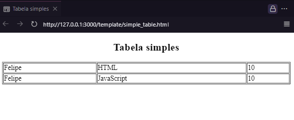
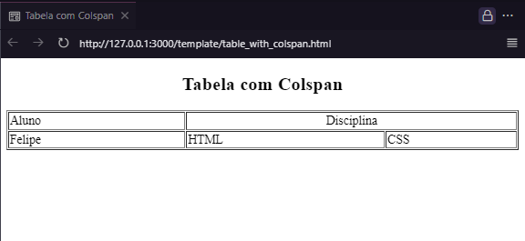
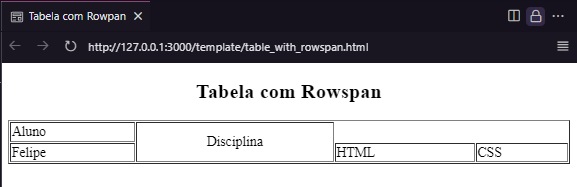
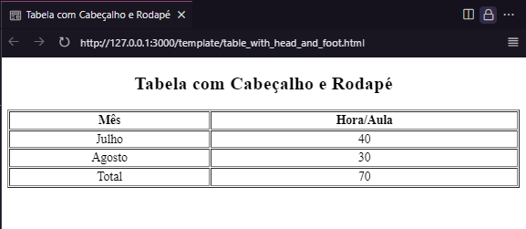

<h1 align="center">Mais sobre tabelas</h1>

Adicionando alguns projetos e aprendizagens que estou desenvolvendo na faculdade de Análise e Desenvolvimento de Sistemas da Estácio. Aqui mostro um pouco mais sobre tabelas, espero que gostem! 

Apresentarei aqui 5 tipos de tabelas, cada tabela irá ter uma maneira diferente de ser construida.

**Conteúdo**

- [Tabela com Título](#tabela-com-título)
- [Tabela Simples](#tabela-simples)
- [Tabela com Colspan](#tabela-com-colspan)
- [Tabela com Rowspan](#tabela-com-rowspan)
- [Tabela com Cabeçalho e Rodapé](#tabela-com-cabeçalho-e-rodapé)

## Tabela com Título

Conseguimos adicionar um título a nossa tabela, desta forma todas as tabelas a seguir irão ter um título.

## Tabela Simples

Como já visto na apresntação de [Listas, tabelas e midias](#https://github.com/Felipe-Tamura/Listas_tabelas_midias) essa tabela é construida de maneira simples, apenas mostrando as tags para aprendizagem.

## Tabela com Colspan

O parâmetro "Colspan" é usado para mesclar um item de duas colunas distintas, veja o exemplo na imagem  para melhor entendimento.

## Tabela com Rowspan

Semelhante a [Colspan](#tabela-com-colspan) o parâmetro "Rowspan" nos dá a possibilidade de mesclar duas linhas distintas uma da outras, veja a imagem abaixo.

## Tabela com Cabeçalho e Rodapé

Aqui iremos adicionar semântica, desta forma nossa tabela terá um cabeçalho com títulos das colunas e talvez um rodapé nos mostrando o total de itens que a tabela possui

